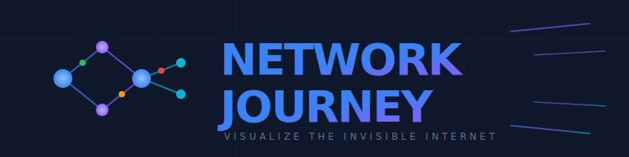

<div align="center">



<br />
<br />

**A cinematic 3D voyage through the invisible infrastructure that powers every click, every search, every connection.**

<br />


<br />

[Launch Demo](#getting-started) · [Features](#-the-experience) · [Tech](#-built-with)

</div>

---

<br />

## 🌌 What Is This?

You type a URL. You press Enter. A webpage appears.

**But what happens in between?**

Network Journey transforms the invisible milliseconds of internet communication into a breathtaking 3D experience. Watch data packets race through fiber optic cables, witness the TCP handshake unfold in real-time, and fly through the digital infrastructure that connects billions of devices.

> _"Finally, networking concepts that don't put you to sleep."_

<br />

## 🚀 The Experience

<table>
<tr>
<td width="50%">

### 🎬 Hyperspace Launch

Begin with a cinematic warp animation — 400 procedurally generated stars streaking past as you accelerate into the network.

</td>
<td width="50%">

### 🌐 DNS Resolution

Watch your domain name transform into an IP address as queries bounce between recursive resolvers.

</td>
</tr>
<tr>
<td width="50%">

### 🤝 TCP Handshake

Experience the legendary 3-way handshake: SYN → SYN-ACK → ACK, visualized as glowing data packets.

</td>
<td width="50%">

### 🔐 SSL/TLS Encryption

See certificates exchange, keys generate, and secure tunnels establish before your eyes.

</td>
</tr>
<tr>
<td width="50%">

### 📦 Data Transfer

Follow HTTP requests through load balancers, NAT gateways, and server farms rendered in stunning 3D.

</td>
<td width="50%">

### 🎨 Browser Rendering

Watch the DOM tree construct, styles cascade, and pixels paint to complete the journey.

</td>
</tr>
</table>

<br />

## ✨ Features

```
┌─────────────────────────────────────────────────────────────┐
│                                                             │
│   ◉ Scroll-driven 3D camera flight through network topology│
│   ◉ Real-time ARP, NAT, and Load Balancer visualizations   │
│   ◉ Animated data packets with physics-based motion        │
│   ◉ Educational HUD with phase-by-phase explanations       │
│   ◉ Hyperspace warp transition with star field             │
│   ◉ Dark theme with neon blue accents                      │
│   ◉ Smooth 60fps animations powered by GSAP                │
│   ◉ Responsive design for all screen sizes                 │
│                                                             │
└─────────────────────────────────────────────────────────────┘
```

<br />

## 🛠 Built With

<div align="center">

|     | Technology               | Role                          |
| :-: | :----------------------- | :---------------------------- |
| ⚛️  | **React 19**             | Component Architecture        |
| 🎮  | **React Three Fiber**    | Declarative 3D Rendering      |
| 🌐  | **Three.js**             | WebGL Engine                  |
| 🎬  | **GSAP + ScrollTrigger** | Scroll-Synchronized Animation |
| 🌊  | **Lenis**                | Butter-Smooth Scrolling       |
| ⚡  | **Vite**                 | Lightning-Fast Dev Server     |
| 🎨  | **Drei**                 | 3D Component Library          |

</div>

<br />

## 🏁 Getting Started

```bash
# Clone the repository
git clone https://github.com/yourusername/network-journey.git

# Navigate to project
cd network-journey

# Install dependencies
npm install

# Launch the experience
npm run dev
```

Open [localhost:5173](http://localhost:5173) and prepare for liftoff. 🚀

<br />

## 📜 Scripts

| Command           | Action                   |
| :---------------- | :----------------------- |
| `npm run dev`     | Start development server |
| `npm run build`   | Build for production     |
| `npm run preview` | Preview production build |
| `npm run lint`    | Check code quality       |

<br />

## 🤝 Contributing

Found a bug in the matrix? Have an idea to make the journey even more epic?

Pull requests are welcome. For major changes, please open an issue first.

<br />

## 📄 License

**MIT** — Use it, learn from it, build upon it.

<br />

---

<div align="center">

**Made with 💙 and way too much caffeine**

_If you learned something, drop a ⭐_

</div>
